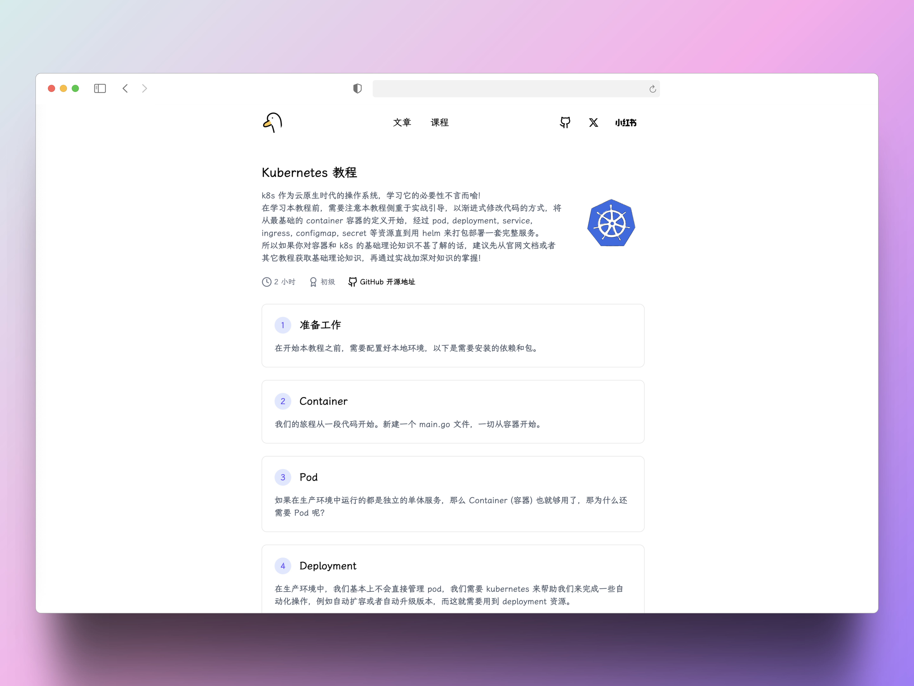

<h1 align=center>Kubernetes Tutorials ｜ k8s 教程 ｜ 免费 ｜ 开源</h1>
<h2 align=center><a href="https://guangzhengli.com/courses/kubernetes">课程网址</a></h1>

<h4 align=center>🌈 Kubernetes | 📰 Tutorials</h4>

k8s 作为云原生时代的操作系统，学习它的必要性不言而喻，如果你遇到了任何问题，可以在 [Discussions](https://github.com/guangzhengli/k8s-tutorials/discussions) 中评论或者 Issue 中提出，如果你觉得这个仓库对你有价值，欢迎 star 或者提 PR / Issue，让它变得更好！

在学习本教程前，需要注意本教程侧重于实战引导，以渐进式修改代码的方式，将从最基础的 container 容器的定义开始，经过 `pod`, `deployment`, `service`,  `ingress`, `configmap`, `secret` 等资源直到用 `helm` 来打包部署一套完整服务。所以如果你对容器和 k8s 的基础理论知识不甚了解的话，建议先从 [官网文档](https://kubernetes.io/zh-cn/docs/home/) 或者其它教程获取基础理论知识，再通过实战加深对知识的掌握！

<h2 align=center><a href="https://guangzhengli.com/courses/kubernetes">已发布到个人网站，观看体验更佳</a></h4>

这里是文档的索引：
* [准备工作](docs/pre.md)
* [container](docs/container.md)
* [pod](docs/pod.md)
* [deployment](docs/deployment.md)
* [service](docs/service.md)
* [ingress](docs/ingress.md)
* [namespace](docs/namespace.md)
* [configmap](docs/configmap.md)
* [secret](docs/secret.md)
* [job/cronjob](docs/job.md)
* [helm](docs/helm.md)
* [dashboard](docs/dashboard.md)

## Sponsor

本仓库是开源的，欢迎大家 star 和 fork，如果你觉得这个仓库对你有帮助，可以通过以下方式支持我：

<h2 align=center><a href="https://guangzhengli.com/blog/zh/build-nextjs-template">支持一下最好的 Next.js 独立开发者启动模板</a></h2>

## Star History

